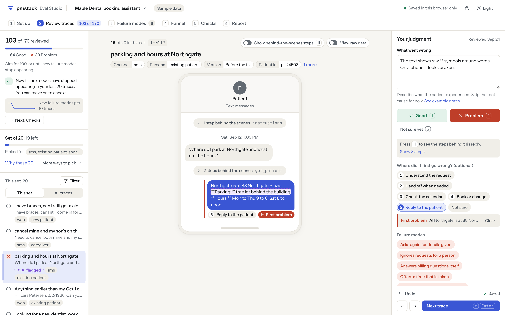
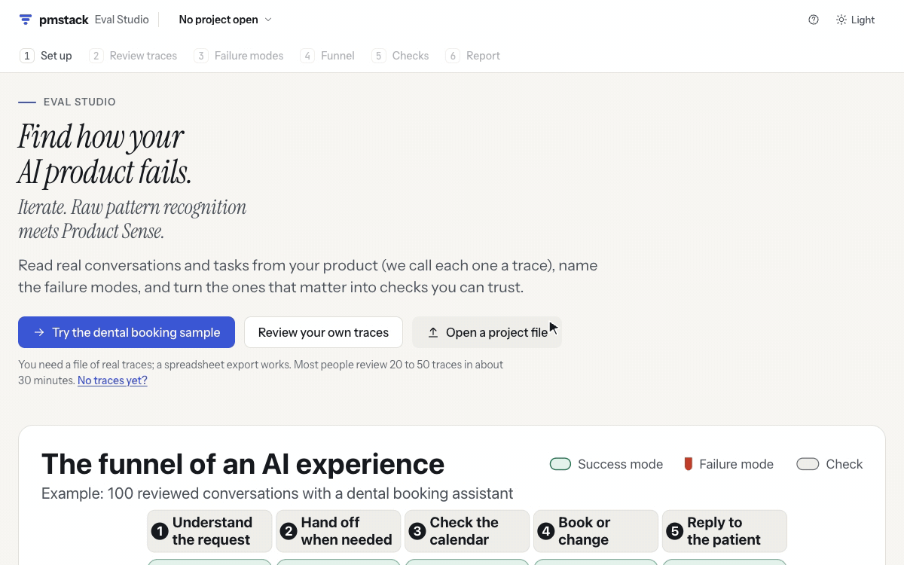
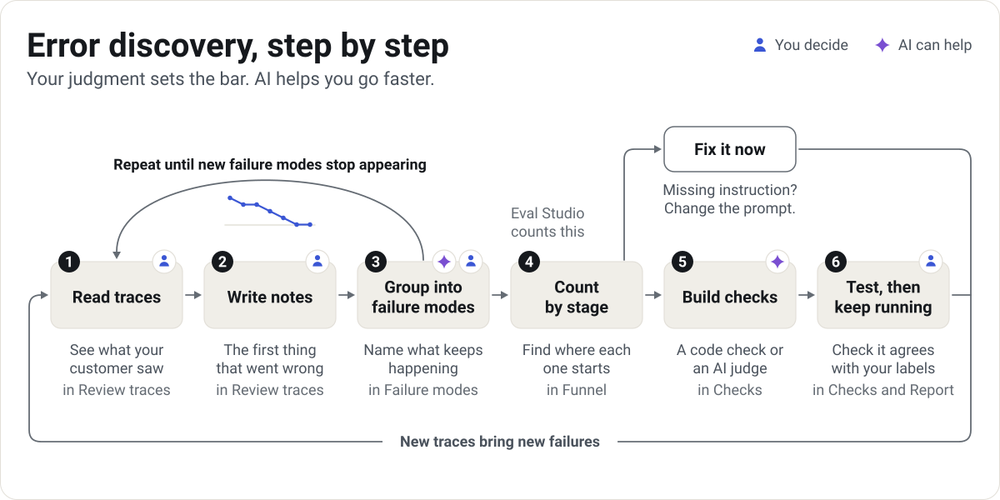
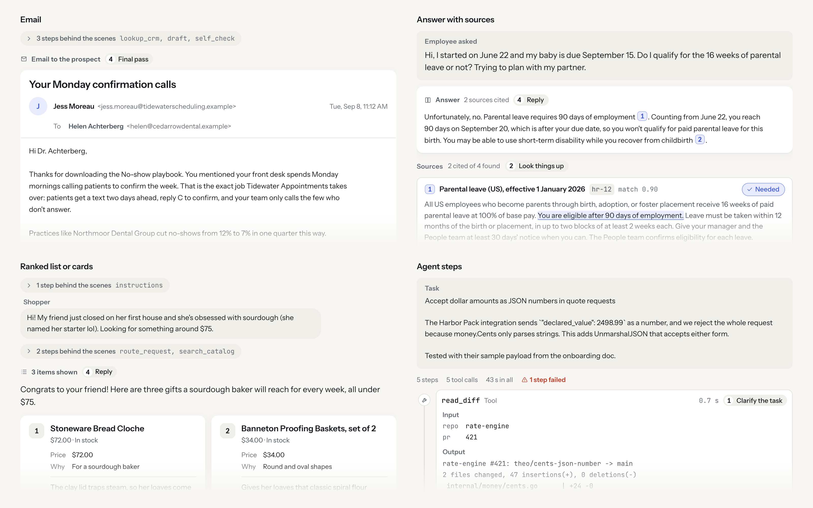
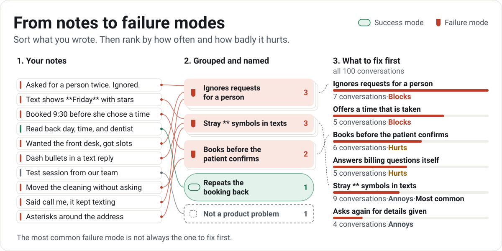
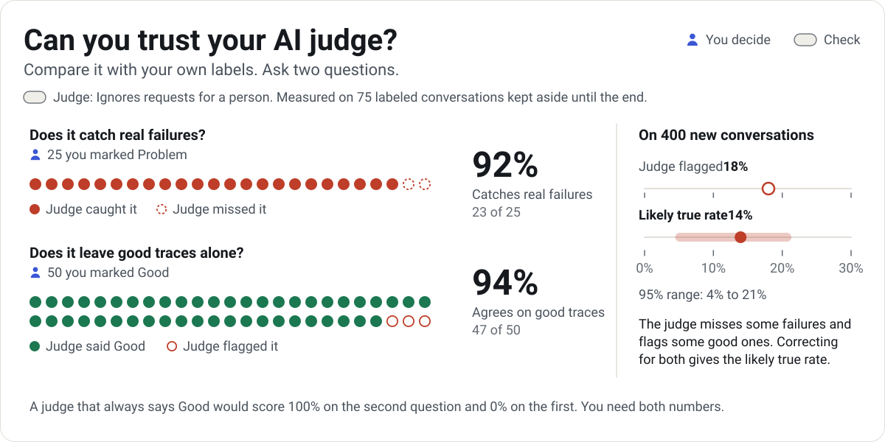

# pmstack

**Find how your AI product fails. Then prove it's fixed.**

pmstack helps product managers read real traces (one full conversation or task, with every step the AI took), name the failure modes and success modes at each stage, and turn the ones that matter into checks you can trust. It follows the error discovery method taught by Hamel Husain and Shreya Shankar.

**[Open Eval Studio](https://ryanalberts.github.io/pmstack/studio/)** · [Try the dental booking sample](https://ryanalberts.github.io/pmstack/studio/#/open/clinic-booking) · [Use it with Claude Code](#try-it-in-60-seconds)

<picture>
  <source media="(prefers-color-scheme: dark)" srcset="docs/assets/visuals/funnel-dark.svg">
  
</picture>

Green chips are success modes to keep working. Red ribbons are failure modes leaving the funnel, each counted once at the first stage that went wrong. The bottom row is the check that now catches each one: a code check (a rule a computer can test) or an AI judge (a prompt that asks a model for pass or fail).

<picture>
  <source media="(prefers-color-scheme: dark)" srcset="docs/assets/screens/review-dark.png">
  
</picture>

Review each trace the way your customer saw it. Here the text message shows raw `**` symbols, so the reviewer presses 2 for Problem and writes what went wrong.

## Try it in 60 seconds

**In your browser.** [Open Eval Studio](https://ryanalberts.github.io/pmstack/studio/) and pick the dental booking sample. Press 1 (Good) or 2 (Problem) on a few traces and write what went wrong. There is nothing to install, and every tab already has data to explore.

<details>
<summary>Watch a 30-second tour</summary>



</details>

**On your computer.** You need Node 20 or newer, nothing else:

```sh
git clone https://github.com/RyanAlberts/pmstack && cd pmstack && node bin/pmstack.mjs studio examples/quickstart --open
```

Point it at your own folder the same way. Your reviews save next to your traces, in a `pmstack/` folder.

**In Claude Code.** Add the plugin, then start:

```
/plugin marketplace add RyanAlberts/pmstack
/plugin install pmstack@pmstack
/pmstack:start
```

`/pmstack:start` asks what you have (traces, no traces yet, an agent that uses tools, evals someone else built) and runs the right skill.

## How it works

<picture>
  <source media="(prefers-color-scheme: dark)" srcset="docs/assets/visuals/loop-dark.svg">
  
</picture>

| Step | What you do | Where in Eval Studio |
|---|---|---|
| 1. Read traces | See each trace the way your customer saw it. | Review traces |
| 2. Write notes | Note the first thing that went wrong, in plain words. | Review traces |
| 3. Group into failure modes | Sort your notes into a short list of named problems, and name what went well as success modes. | Failure modes |
| 4. Count by stage | See where each failure mode starts and how often, then decide: fix it now, build a check, or keep watching. | Funnel |
| 5. Build checks | Turn each failure mode worth tracking into a code check or an AI judge. | Checks |
| 6. Test, then keep running | Make sure each check agrees with your labels, then run it on every change. | Checks, Report |

Metrics picked before anyone reads traces measure the wrong things: a helpfulness score can't see a booking assistant that offers a time that is already taken. A polite, well-written reply can still lose the sale, and only reading the trace shows it. So you read first, and every check you build tracks a failure your customers hit. The method is Hamel Husain and Shreya Shankar's, and [Learn the method](#learn-the-method) links their guides.

## Every product is a different funnel

<picture>
  <source media="(prefers-color-scheme: dark)" srcset="docs/assets/visuals/patterns-dark.svg">
  
</picture>

Pick how your AI works (one call with tools, a step by step chain, sort and route, planner and workers, a draft and critique loop, or an agent) and pmstack starts you with stages that fit. [How your AI works](guides/agent-patterns.md) shows where failures usually start in each and what to check first.

<picture>
  <source media="(prefers-color-scheme: dark)" srcset="docs/assets/screens/views-dark.png">
  
</picture>

One studio, very different products: an email writer, a policy answer bot with sources, a gift finder, and an agent's step list.

Eval Studio draws text messages, web chat, phone calls, emails, documents, answers with sources, agent steps, code reviews, form fields, and ranked lists, and when none of those fits, **Build your own view** lets you pick the fields to show ([product setup guide](guides/experience-config.md)).

## Checks for agents that use tools

<picture>
  <source media="(prefers-color-scheme: dark)" srcset="docs/assets/visuals/tool-calls-dark.svg">
  
</picture>

When your agent looks things up or changes things for your customer, ask three questions of every tool call:

1. **Policy: Is this call allowed?** Your company's rules for which tools the agent may use, when, and with what details.
2. **Relevance: Is it the right call for what the customer asked?** Right tool, right details, no calls the request didn't need, none it skipped.
3. **Output grounding: Does the reply match what the tool returned?** No contradicted values, no invented facts, no dropped qualifiers (pending shown as done), no success claimed after a failed call.

Policy rules are requirements your company already knows, so you write them down first, then read traces for the rules nobody wrote down. Relevance and output grounding problems show up when you read traces: confirm them in your own, then start from the ready-made [templates](templates/tool-calls/).

| In Claude Code | What it does |
|---|---|
| `/pmstack:tool-policy` | Turns your company's requirements into a policy file, tests it on past traces, and shows how to block a bad call before it runs. |
| `/pmstack:tool-relevance` | Builds an intent map (for each kind of request, the tools it needs, may use, and must never use) or an AI judge for the right call. |
| `/pmstack:tool-grounding` | Adds two code checks for the reply (a number no tool returned, success claimed after a failed call), then an AI judge for reworded facts. |

Try them on the [support agent sample](https://ryanalberts.github.io/pmstack/studio/#/open/support-agent), and read the [tool call checks guide](guides/tool-call-evals.md).

## Inside the method

<picture>
  <source media="(prefers-color-scheme: dark)" srcset="docs/assets/visuals/notes-to-modes-dark.svg">
  
</picture>

**From notes to failure modes.** Grouping turns a pile of notes into a short list of failure modes, named in your customer's words. Then pmstack ranks them by traces times severity (Blocks counts 3, Hurts 2, Annoys 1). In the dental booking sample, stray symbols in texts is the most common failure mode at 9 conversations, but ignoring requests for a person ranks first: 7 conversations, and each one blocks the patient.

<picture>
  <source media="(prefers-color-scheme: dark)" srcset="docs/assets/visuals/judge-trust-dark.svg">
  
</picture>

**Can you trust your AI judge?** A judge is a prompt, so it makes mistakes, and you measure them before you trust its numbers. pmstack sets part of your labels aside as a final test and reports two numbers: how many real failures the judge catches, and how many good traces it leaves alone. In this example the judge catches 23 of 25 real failures and leaves 47 of 50 good ones alone. It flags 18% of 400 new conversations, and after correcting for its known mistakes, the likely true failure rate is 14%.

## What's inside

### Eval Studio

A web app with six tabs. It runs [on the web](https://ryanalberts.github.io/pmstack/studio/), or on your computer with `node bin/pmstack.mjs studio <folder>`.

| Tab | What you do there | Steps |
|---|---|---|
| 1 Set up | Load your traces and choose how your product looks. | Before you start |
| 2 Review traces | Read each trace, mark Good or Problem, and write what went wrong. | 1, 2 |
| 3 Failure modes | Group your notes into named failure modes and success modes. | 3 |
| 4 Funnel | See the stage where each failing trace went wrong first, and what to fix first. | 4 |
| 5 Checks | Turn the failure modes that matter into checks, and confirm they agree with you. | 5, 6 |
| 6 Report | Share what you found and hand checks to your engineers. | 6 |

Six sample products come with it: a dental booking assistant, an outreach email writer, a policy answer bot, a gift finder, a pull request reviewer, and an internet provider's support agent.

### Skills

Twelve skills for Claude Code and any agent that reads skills. [skills/README.md](skills/README.md) shows how to install them in Codex, Cursor, Gemini CLI, and Claude on the web.

| Skill | Use it when | In Claude Code |
|---|---|---|
| [`pmstack-start`](skills/pmstack-start/SKILL.md) | You are not sure where to begin | `/pmstack:start` |
| [`pmstack-error-discovery`](skills/pmstack-error-discovery/SKILL.md) | You have traces and want to find how the product fails | `/pmstack:error-discovery` |
| [`pmstack-synthetic-traces`](skills/pmstack-synthetic-traces/SKILL.md) | You have no real traces yet | `/pmstack:synthetic-traces` |
| [`pmstack-write-judge`](skills/pmstack-write-judge/SKILL.md) | A failure mode needs an AI judge | `/pmstack:write-judge` |
| [`pmstack-validate-judge`](skills/pmstack-validate-judge/SKILL.md) | You need to know whether a judge agrees with you | `/pmstack:validate-judge` |
| [`pmstack-evaluate-rag`](skills/pmstack-evaluate-rag/SKILL.md) | Your product answers questions by searching documents | `/pmstack:evaluate-rag` |
| [`pmstack-custom-view`](skills/pmstack-custom-view/SKILL.md) | Your traces don't look the way your customer saw them | `/pmstack:custom-view` |
| [`pmstack-eval-audit`](skills/pmstack-eval-audit/SKILL.md) | You inherited evals and want to know if the numbers hold up | `/pmstack:eval-audit` |
| [`pmstack-regression-checks`](skills/pmstack-regression-checks/SKILL.md) | You want checks on every code change and in production | `/pmstack:regression-checks` |
| [`pmstack-tool-policy`](skills/pmstack-tool-policy/SKILL.md) | Your agent's tool calls must follow company rules | `/pmstack:tool-policy` |
| [`pmstack-tool-relevance`](skills/pmstack-tool-relevance/SKILL.md) | Your agent picks the wrong tool or the wrong details | `/pmstack:tool-relevance` |
| [`pmstack-tool-grounding`](skills/pmstack-tool-grounding/SKILL.md) | Your agent's replies don't match its tool results | `/pmstack:tool-grounding` |

### Command line

`bin/pmstack.mjs` runs on Node 20 or newer with nothing to install. Each line below works on the samples right after you clone:

```sh
# Make a project file from a trace file, without opening the studio
node bin/pmstack.mjs import examples/quickstart/traces.jsonl --out quickstart.json

# Run the code checks on every trace (exits 1 when a trace fails, so a build can stop on it)
node bin/pmstack.mjs check docs/studio/samples/clinic-booking.json

# How often a check agrees with your labels
node bin/pmstack.mjs agreement docs/studio/samples/clinic-booking.json --check ck-stray-symbols

# Run an AI judge with your own model command (here Claude Code's), on a copy of the sample
cp docs/studio/samples/clinic-booking.json clinic.json
node bin/pmstack.mjs judge clinic.json --check ck-person-judge --cmd "claude -p --model {model}" --limit 10

# Check every tool call against your company's rules
node bin/pmstack.mjs policy docs/studio/samples/support-agent.json --policy templates/tool-calls/policy.json

# Write the report (with a funnel picture) and the regression set for your engineers
node bin/pmstack.mjs report docs/studio/samples/clinic-booking.json --out report.md
node bin/pmstack.mjs regression-set docs/studio/samples/clinic-booking.json --out regression.jsonl
```

`node bin/pmstack.mjs --help` lists every command, and the [command line guide](guides/cli.md) covers each option.

## Your data stays on your computer

Eval Studio on the web keeps your traces and reviews in your browser's storage, and nothing is uploaded. On your computer, `pmstack studio` listens only on 127.0.0.1 and saves plain files in a `pmstack/` folder next to your traces. AI help runs only when you start it: you paste a prompt into an AI assistant your company approves, or run a judge with your own model command.

## Make it fit your product

- [The method, step by step](guides/method.md): the six steps in depth, with examples from the samples.
- [Trace format](guides/trace-format.md): every file shape pmstack reads, trace ids, and mapping your own fields.
- [Product setup](guides/experience-config.md): views, stages, which steps belong to each stage, a view per channel, and custom views.
- [Checks and AI judges](guides/checks-and-judges.md): code checks, judges, labels, the final test, and running checks on every change.
- [Tool call checks](guides/tool-call-evals.md): policy, relevance, and output grounding, with every rule type.
- [How your AI works](guides/agent-patterns.md): eight patterns, where failures start in each, and what to check first.
- [Command line](guides/cli.md): every command, option, and exit code.

## Learn the method

pmstack puts into practice what Hamel Husain and Shreya Shankar teach. Go to the source:

- [Building eval systems that improve your AI product](https://www.lennysnewsletter.com/p/building-eval-systems-that-improve-your-ai-product), their guide in Lenny's Newsletter.
- [Advanced evals: How to find (and fix) hidden AI failures in your product](https://www.lennysnewsletter.com/p/advanced-evals-how-to-find-and-fix), the follow-up on error discovery.
- [AI Evals For Engineers & PMs](https://maven.com/parlance-labs/evals), their course.
- [Evals FAQ](https://hamel.dev/blog/posts/evals-faq/), their answers to the questions teams ask most.
- [evals-skills](https://github.com/ai-evals-course/evals-skills), their skills for coding agents.
- [Building effective agents](https://www.anthropic.com/engineering/building-effective-agents), Anthropic's guide, where the pattern names come from.

pmstack is independent and not affiliated with them.

## Upgrading from pmstack 1.x

pmstack 2.0 is rebuilt around error discovery. The earlier PM commands (`/prd`, `/weekly`, `/competitive`, `/metrics`, `/brief`, `/eval`, `/run-eval`, and others), the evaluation harness, and the evaluation workspace were retired in 2.0. Get them from the `v1.2.0` tag:

```sh
git clone --branch v1.2.0 https://github.com/RyanAlberts/pmstack pmstack-1.2
```

The [changelog](CHANGELOG.md) lists what changed and where each retired piece went.

## License

MIT. See [LICENSE](LICENSE), and [credits](guides/credits.md) for the work pmstack builds on.
