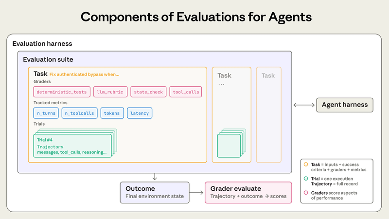

# pmstack

### This is how you ship evals as a PM.

> [!TIP]
> ### Can you tell when your AI feature gets worse?
> **[Take the 2-minute Eval-Readiness check →](https://ryanalberts.github.io/pmstack/eval-readiness/)** &nbsp; · &nbsp; 8 questions · no email · instant score.
> Most PMs find out they're shipping on vibes — then it names the one gap to fix first.

---

An **eval** is how you prove an AI feature is actually good — and *stays* good after the next model update. In 2025 it became the line between a real AI PM and one who ships and hopes (OpenAI's CPO, Lenny, and a16z all said as much). But every eval tool is built for ML engineers: dashboards, SDKs, CI pipelines. **pmstack is the one a PM runs.** Here, `/eval` is a command — not a $2,000 course.

It's a set of commands you run inside Claude — terminal *or* phone, no code. The eval lifecycle is the core; the rest of your PM workflow (PRDs, competitive teardowns, launch-readiness gates, the Monday memo) rides along in the same place.

> If gstack is the engineer's setup, pmstack is the PM's. Prove you know whether the model is any good. A feature flag won't tell you your model got quietly dumber overnight after a version bump. An eval will.

**See it in 30 seconds.** Point it at any AI feature — get a real test suite, not advice:

```
/eval "AI code-review bot that comments on pull requests"
```

<p align="center">
  
  <br><sub><em>A real run — the YAML shown is actual /eval output, not a mockup.</em></sub>
</p>

→ a runnable eval YAML: tasks, graders (code / model / human), negative cases, and the **pass^k** bar you'd gate a launch on. [See a full one ›](./examples/walkthrough-code-review/eval-code-review-2026-05-06.yaml) Then `/run-eval` scores it against the real system and flags the week it regresses.

That's the wedge. The PRDs, voice-of-customer synthesis, and stakeholder briefs are table stakes — every AI writes those. **An eval a PM can actually run is the part nobody else ships.**

**Brand new?** Run `/onboarding` once — it walks the whole stack on a real example, start to finish. If it earns a place in your workflow, star the repo so you can find your way back.

---

## Two kinds of PM, one toolkit

You don't have to be "technical." You have to be able to run a command.

**Terminal PM** — you live in the shell. Install pmstack as Claude Code slash commands and get one muscle-memory across every artifact you ship.

**Phone-and-browser PM** — you work in claude.ai on web, desktop, or your phone. Upload the skills to a Claude Project and the same commands fire on plain English. No terminal, ever — same commands, same outputs.

---

## Install

### Path 1: claude.ai web, desktop, or mobile (non-technical PMs)

**~30 seconds. No terminal.**

1. claude.ai → **Projects** → new Project ("PM toolkit").
2. **Settings → Skills → Upload skill** → upload each folder from [`claude-skills/`](./claude-skills/). All 18, or pick the 4–5 you'll use most.
3. Chat normally. "Write a PRD from this customer quote" auto-activates the skill; output appears inline — copy-paste anywhere.

### Path 2: Claude Code plugin (technical PMs — recommended)

**Two commands inside Claude Code. Versioned updates, clean uninstall, nothing piped to bash.**

```
/plugin marketplace add RyanAlberts/pmstack
/plugin install pmstack@pmstack
```

Commands arrive namespaced — `/pmstack:eval`, `/pmstack:prd`, `/pmstack:weekly` — and all 18 skills auto-activate on plain English ("write a PRD from this customer quote"). Update later with `/plugin`, no re-install.

<details>
<summary>Classic copy-install (bare /eval, /prd names) / other tools (Cursor, ChatGPT, Gemini, …)</summary>

```bash
curl -fsSL https://raw.githubusercontent.com/RyanAlberts/pmstack/main/install.sh | bash -s -- --global
```

Installs to `~/.claude/` so the commands work in any folder under their bare names. Drop `--global` to install in the current folder only.

```bash
git clone https://github.com/RyanAlberts/pmstack.git && cd pmstack
./setup --global    # or: ./setup ~/work/my-pm-stuff
```

For non-Claude tools, see [docs/using-other-tools.md](./docs/using-other-tools.md) — the skills are plain markdown, paste them into `.cursorrules`, a Custom GPT, or a system prompt.

</details>

---

## Start here

If you just installed pmstack, run this once. It's the only command you need to remember.

| Command template | What it answers | What you get | Where it runs |
|---|---|---|---|
| `/onboarding` | "I just installed pmstack. Where do I start?" | A 9-step interactive tutorial running every capability in this README with examples so you can see what good looks like | CLI · web · desktop |

### Prefer to browse first?

- [examples/walkthrough-code-review/](./examples/walkthrough-code-review/) — the full set of artifacts a PM produced over a realistic week working on an "AI code review" feature. Thirteen files, all referencing each other.
- [examples/walkthrough-compare-tools/](./examples/walkthrough-compare-tools/) — what `/compare` produces (Cursor vs Windsurf).
- [examples/inputs/README.md](./examples/inputs/README.md) — every command's example input, copy-pasteable.

---

## What's an eval? 

An **eval** is the test suite for an AI feature - it's how we evaluate non-deterministic systems like LLMs, agents, and agentic systems. You define inputs ("what a real user might say") and what success looks like, then run these inputs through your AI system and score the results. This repo hands you the measurement apparatus — the same way you rely on your engineering team to write unit and integration tests for traditional software. 

[From Anthropic] "An evaluation (“eval”) is a test for an AI system: give an AI an input, then apply grading logic to its output to measure success." 

<p align="center">
  
</p>

<p align="center">
  <sub>
    <em>Image taken from Anthropic — <a href="https://www.anthropic.com/engineering/demystifying-evals-for-ai-agents"><strong>Demystifying Evals for AI Agents</strong></a> (Anthropic Engineering, 2025). Used with attribution; original copyright Anthropic, PBC. Read the full article for the canonical guidance pmstack draws on.</em>
  </sub>
</p>

**Fluency in evals separates an AI PM from a traditional PM.** Traditional PMs ship a feature, instrument a dashboard, and read the launch metric. AI PMs do all of that *and* maintain a structured measurement of how the model itself behaves — because LLM outputs are non-deterministic, drift between model versions, and fail in ways feature flags can't catch.

**pmstack implements [Anthropic's eval framework](https://www.anthropic.com/engineering/demystifying-evals-for-ai-agents) as PM-runnable commands.** The Anthropic article is the canonical reference; you don't have to read it cover-to-cover before shipping. pmstack is the operating layer that produces its artifacts — [task suites, transcripts, graders, drift watches](#glossary) — without writing engineering scaffolding. Five commands cover the lifecycle in flow order:

- **`/vibe-test`** — Read raw transcripts of your AI feature in action; surface failure patterns and draft task candidates *before* you formalize a test suite. (Anthropic's "start with manual testing" ritual.)
- **`/eval`** — Design the suite. Output: a YAML with tasks, metrics, graders (`code` / `model` / `human`), and pass-bars.
- **`/run-eval`** — Execute the suite against a real AI system; report **pass@k** AND **pass^k**. Hard-stops if no target is configured — never invents fake scores.
- **`/transcript-review`** — Walk every failed trial asking the diagnostic question: *model mistake, grader mistake, or task-spec error?* (Anthropic's "read the transcripts" ritual.)
- **`/eval-drift`** — Re-run the suite weekly, diff against last week, flag any regression as a release blocker.

First-time setup: [docs/run-eval-setup.md](./docs/run-eval-setup.md). How pmstack maps to Anthropic's 8-step roadmap: [docs/anthropic-framework.md](./docs/anthropic-framework.md).

---

## What you get

A growing set of capabilities, each packaging a task to delegate to AI. The logical flow is Spec creation → Measurement → Communicate & orchestrate, with Routines giving you the operating discipline. Each command produces a real markdown or YAML artifact (or, on web/desktop, an inline block you can copy).

**Don't try to memorize them all.** Run `/onboarding` once — it walks the whole stack with a real signal and produces a complete artifact set you can compare to the bundled examples.

&nbsp;

### Spec creation — Signal to shippable

Translate the noise of customer signals, competitor moves, and market gaps into structured artifacts engineering can plan from.

| Command template | What it answers | What you get | Where it runs |
|---|---|---|---|
| `/voc [paste \| attach \| --from-folder]` | "I have a pile of feedback — what's the real problem and what do I build first?" | Themes scored by frequency × severity × fit + top-3 PRD-ready problems → [example](./examples/walkthrough-code-review/voc-code-review-2026-05-04.md) | CLI · web · desktop · mobile |
| `/prd "<a customer signal>"` | "Customer said X. What's the spec?" | A 6-section PRD draft → [example](./examples/walkthrough-code-review/prd-code-review-2026-05-05.md) | CLI · web · desktop · mobile |
| `/competitive "<market>"` | "Who else is in this space and where's the white space?" | Landscape with positioning + white-space analysis → [example](./examples/walkthrough-code-review/competitive-ai-code-review-2026-05-05.md) | CLI · web · desktop · mobile |
| `/compare "<product A>" "<product B>" [...]` | "Which of these should we pick — and how would we test it?" | Feature matrix + decision rules + executable eval YAML → [example](./examples/walkthrough-compare-tools/) | CLI · web · desktop · mobile |

&nbsp;

### Measurement — What does "good" look like?

Define how you'll know your work succeeded, then check whether it did — using Anthropic's framework end-to-end. The six commands below run in flow order: define metrics, read the data, design the suite, run it, diagnose failures, keep pmstack itself honest.

| Command template | What it answers | What you get | Where it runs |
|---|---|---|---|
| `/metrics "<feature>"` | "How will we know this worked?" | North Star + 2–3 supporting + 1–2 counter-metrics → [example](./examples/walkthrough-code-review/metrics-code-review-2026-05-06.md) | CLI · web · desktop · mobile |
| `/vibe-test "<feature>"` | "What does this AI feature actually do in the wild?" | A vibe-test memo — failure patterns + task candidates + 'ready for `/eval`?' verdict (reads transcripts via paste, attach, or `--from-folder`) | CLI · web · desktop · mobile |
| `/eval "<AI feature>"` | "What does 'good' actually look like for this AI feature?" | A test-suite YAML — tasks, metrics, graders (code/model/human), pass@k or pass^k → [example](./examples/walkthrough-code-review/eval-code-review-2026-05-06.yaml) | CLI · web · desktop · mobile |
| `/run-eval <eval-yaml-path>` | "Does this AI feature actually pass the bar?" | A scored summary.md with **both pass@k AND pass^k**, top failures, cost → [example](./examples/walkthrough-code-review/eval-runs/code-review-eval-2026-05-06/summary.md) | CLI only (needs a real target) |
| `/transcript-review <run-folder>` | "Why did these trials fail — model, grader, or task?" | A diagnosis memo — per-trial verdicts + proposed eval changes (reads `/run-eval` output) | CLI · web · desktop · mobile |
| `/eval-self [--skill <name>]` | "Is pmstack itself still good?" | Scores every pmstack skill against canonical scenarios | CLI only |

&nbsp;

### Communicate & orchestrate

Package your work for the audience that needs it, or chain the right tools in the right order.

| Command template | What it answers | What you get | Where it runs |
|---|---|---|---|
| `/brief "<topic>" <audience>` | "What does the exec / eng team / customer need to know?" | A one-page audience-sized brief → [example](./examples/walkthrough-code-review/brief-code-review-exec-2026-05-09.md) | CLI · web · desktop · mobile |
| `/sprint "<a customer signal>"` | "Take this from signal to ship-ready in one pass." | Four artifacts in sequence — PRD → metrics → eval → brief — with confirmation gates | CLI · web · desktop |

&nbsp;

### Routines — Become an AI Director

Recurring patterns that turn pmstack from a set of one-shot commands into a PM operating system. They schedule themselves, audit your workspace, gate launches, and force you to notice your own learning. **This layer is what separates someone running prompts ad hoc from someone directing an AI-augmented workflow.**

| Command template | What it answers | What you get | Where it runs |
|---|---|---|---|
| `/eval-drift` | "Did my AI feature get worse this week?" | Drift memo with `RELEASE_BLOCKED: true\|false` flag → [example](./examples/walkthrough-code-review/eval-drift-2026-05-12.md) | CLI only (needs real eval runs) |
| `/premortem <prd-slug>` | "How could this feature fail?" | 3 failure stories + leading indicators + mitigations; mutates the PRD's Risks section → [example](./examples/walkthrough-code-review/premortem-code-review-2026-05-05.md) | CLI · web · desktop · mobile |
| `/weekly` | "What changed in my thinking this week?" | Decisions made + open loops aging + one required 'changed my mind' field → [example](./examples/walkthrough-code-review/weekly-2026-W19.md) | CLI · web · desktop |
| `/launch-readiness <feature>` | "Are we actually ready to ship this?" | GO / NO-GO / CONDITIONAL verdict + 7-item evidence checklist → [example](./examples/walkthrough-code-review/launch-readiness-code-review-2026-05-09.md) | CLI · web · desktop · mobile |
| `/lint` | "Did anything in my workspace drift out of sync?" | Graph gaps + cross-artifact drift + stale candidates with 'Do this:' actions → [example](./examples/walkthrough-code-review/lint-2026-05-08.md) | CLI · web · desktop |

**Schedule with `/loop`** so the routines run themselves:

```bash
/loop 7d /weekly       # Monday self-snapshot
/loop 7d /lint         # workspace audit
/loop 7d /eval-drift   # weekly eval-regression watch
```

---

## A week with pmstack

A typical week, end to end: a pile of customer signals lands → `/voc` synthesizes it and surfaces the problem that matters most → `/prd` translates that problem into a spec → `/premortem` stress-tests it → `/sprint` chains metrics, eval, and brief → `/launch-readiness` gates the ship → `/eval-drift` watches it after launch. Meanwhile `/lint` keeps your workspace tidy and `/weekly` captures what changed in your thinking. The full week, with all 13 artifacts, lives in [examples/walkthrough-code-review/](./examples/walkthrough-code-review/).

---

## What it looks like (claude.ai web — non-technical path)

The demo GIF above is the terminal. On claude.ai there is no terminal at all: upload the skills to a Project once, then chat normally — *"I just installed pmstack, walk me through it"* auto-activates the onboarding skill, and *"write a PRD from this customer quote"* fires `/prd` without you typing a command. Same skills, same artifacts, inline in the conversation. No install path, no slash commands to memorize.

---

## Get started in 60 seconds

If you installed the CLI:

```bash
cd ~/work/my-pm-stuff      # or wherever you installed
claude                       # opens Claude Code
```

Then type:

```
/onboarding
```

That's it. The tutorial does the rest.

If you installed via claude.ai, just open the Project you set up and ask: *"walk me through pmstack."*

---

## Glossary

The Anthropic eval-framework vocabulary, with concrete examples drawn from the bundled "AI code review" walkthrough so each term ties to something runnable.

| Term | What it means | Example (AI code review) |
|---|---|---|
| **Task** | One test case. An input plus a definition of what success looks like. The atomic unit of an eval suite. | *"Given this 18-line bugfix PR, the bot should produce a summary that names the bug, 0–2 inline comments, and a CODEOWNER as the suggested reviewer."* |
| **Trial** | One attempt at a task. Models are non-deterministic, so we run multiple. pmstack default: **5 trials per task**. | The bot is shown the same PR five times. Three trials produce great reviews, one is mid, one calls a clean diff "suspicious." That spread is the data. |
| **Transcript** | The full record of one trial — the input the bot saw, its reasoning, every tool call, intermediate output, and the final answer. (a.k.a. trace, trajectory.) | The five mock files at [`examples/walkthrough-code-review/transcripts/`](./examples/walkthrough-code-review/transcripts/). Each shows what the bot saw, what it said, and what happened next. |
| **Outcome** | The final state of the world after the trial — distinct from what the agent *said* it did. | The transcript says *"I posted a comment."* The outcome is whether the comment actually appears on the PR in GitHub. |
| **Grader** | The logic that scores a trial. Three flavors: **code** (deterministic), **model** (LLM-as-judge with a rubric), **human** (SME spot-check). One task can have several. | `comments_per_pr_p75` → graded by **code** (count the comments). `severity_calibration` → graded by **model** (Claude judges the bot's severity tags vs. a rubric). `refusal_precision` → graded by **human** (SME labels 24 cases by hand). |
| **Suite** | The whole eval YAML — a collection of tasks measuring some capability or guarding a regression. | [`eval-code-review-2026-05-06.yaml`](./examples/walkthrough-code-review/eval-code-review-2026-05-06.yaml) — 8+ tasks, 7 metrics, one target system. |
| **Capability eval** | *"What can this agent do well?"* Starts at a low pass-rate. Gives the team a hill to climb. | Launch suite for a brand-new feature: pass-rate sits at 60%, climbing weekly as you fix prompts and edge cases. |
| **Regression eval** | *"Does it still handle what it used to?"* Should sit near 100%. Any drop is a release blocker. | The launch suite graduated to a regression suite once it hit 95% consistently — now it just guards the floor. |
| **pass@k** | Probability the agent gets it right on **at least one** of k trials. Use when one success is enough (a tool with retry). | A coding agent: as long as one of 5 attempts works, the dev moves on. **pass@5** is the right metric. |
| **pass^k** | Probability the agent gets it right on **every one** of k trials. Use when consistency matters (customer-facing). | The code review bot: every dev expects it to work every time. **pass^5** is the right metric — and the bar PMs gate launches on. |
| **Drift watch** | A scheduled re-run of the eval that diffs against last week and hard-stops releases on regression. | `/loop 7d /eval-drift` runs every Monday. If `severity_calibration` drops from 4.3 → 3.8, the memo includes `RELEASE_BLOCKED: true`. |
| **Negative case** | A task where the agent should **not** do something. For every "should-do-X" case, include a "should-not-do-X" companion — Anthropic's balanced-set rule. | *"PR uses parameterized SQL that looks unsafe — bot should NOT flag SQL injection."* Marked `negative_case: true`. |
| **Reference solution** | A known good output that passes all the graders. Proves the task is solvable and that the graders are wired up correctly. | *"On the bugfix PR, a reference solution would be: a summary naming the off-by-one, one inline asking for a unit test, `@django-pagination-codeowner` as reviewer."* |

Want the deeper version? See [`docs/anthropic-framework.md`](./docs/anthropic-framework.md) for the full mapping of pmstack commands to Anthropic's 8-step eval roadmap.

---

## Common questions

**Do I need to know how Claude works internally?**
No. You should know what an LLM is and roughly that they have limits, but pmstack hides everything else.

**Does this cost money?**
The commands themselves are free. The Claude tokens used to run them count against your Claude subscription (Pro/Max/Team) or API key. A typical PRD or competitive analysis is well under a penny. The `/run-eval` and `/eval-self` commands can use more tokens — they tell you the estimate before each run and ask before spending.

**What if I want to change how a command behaves?**
Open the file in `skills/<name>.md` (e.g., `skills/prd-from-signal.md`) and edit. The skill is just markdown — Claude reads it as instructions. Save and re-run; your changes apply immediately.

**Is my data sent anywhere unusual?**
No. Everything runs through your existing Claude account. pmstack adds no servers, no telemetry, no third parties. The skills are just markdown files on your disk (or, on claude.ai, files Anthropic stores in your Project).

**Can I use pmstack on a project that isn't pmstack itself?**
Yes — that's the point. Install with `--global` (CLI) or upload the skills to a Project (claude.ai) once, and the commands are available wherever you do PM work.

**The five new routines look like a lot. Where do I start?**
Run `/onboarding`. It walks you through every routine with the bundled walkthrough. After that, the highest-leverage starting routine is `/premortem` — runs in 60 seconds against any PRD, mutates the Risks section, and the lift on launch-decision quality is the largest in the set.

---

## Want to contribute, fork, or learn how it's built?

- [DECISIONS.md](./DECISIONS.md) — every design choice and why
- [docs/using-other-tools.md](./docs/using-other-tools.md) — how to use pmstack outside Claude Code
- [skills/_graph.yaml](./skills/_graph.yaml) — the canonical skill graph
- [outputs/pmstack-roadmap-2026-04-24.md](./outputs/pmstack-roadmap-2026-04-24.md) — what's coming next
- Inspired by [Gstack](https://github.com/garrytan/gstack) and [Karpathy's LLM Wiki](https://gist.github.com/karpathy/442a6bf555914893e9891c11519de94f)

---

Built by [Ryan Alberts](https://github.com/RyanAlberts) — Staff PM in agentic AI at AWS, turning customer signals into measured outcomes for a living. pmstack even evals itself (`/eval-self`). If it makes you a sharper PM, **star it** — and send the PR that makes it better.
