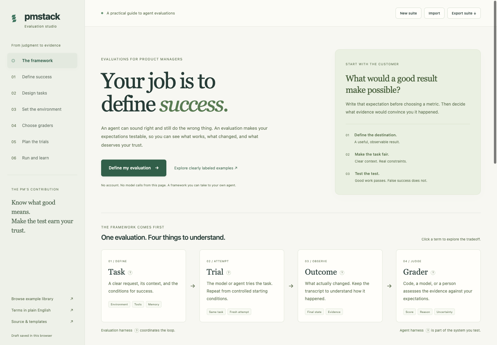

# pmstack

## Your job is to define success.

An AI agent can sound convincing and still produce the wrong result. Evaluations make your product expectations testable: what should happen, under which conditions, and what evidence would prove it?

pmstack helps product managers design and run those evaluations. Start with the framework, adapt a clearly labeled example to your own use case, then connect your model or agent to the harness.

**[Open the evaluation studio →](https://ryanalberts.github.io/pmstack/workspace/)** · [Learn the framework](docs/eval-framework.md) · [Run a working example](examples/eval-adapters/README.md)

[](https://ryanalberts.github.io/pmstack/workspace/)

## The framework comes first

The terminology follows [Anthropic’s guide to agent evaluations](https://www.anthropic.com/engineering/demystifying-evals-for-ai-agents). The PM supplies the judgment: customer value, meaningful challenges, acceptable tradeoffs, and the standard for a good outcome.

| Element | What it means | The PM’s decision |
| --- | --- | --- |
| Task | One test case with inputs and success criteria. | Is the request clear, challenging, and valuable to a customer? |
| Environment and context | The tools, starting state, information, permissions, and memory available. | What must match real use, and what must stay fixed for a fair comparison? |
| Trial | One attempt at a task. | How many attempts reveal useful variation without confusing retries with reliability? |
| Transcript | The available record of outputs, tool interactions, and intermediate events. | What evidence will explain a failure? |
| Outcome | The final state after the attempt. | Did the work happen, beyond the agent claiming it did? |
| Grader | Code, a model, or a person assessing a part of the result. | What evidence and scoring rule capture success without rewarding a shortcut? |
| Evaluation suite | Tasks grouped around a capability or quality bar. | Does the mix cover both correct action and correct restraint? |
| Evaluation harness | Infrastructure that runs trials, gathers evidence, grades, and reports. | Can you distinguish target failure from a broken evaluation? |
| Agent harness | The runtime that gives a model tools, context, and memory. | Which complete system are you evaluating and versioning? |

A reference solution shows one acceptable result. Use it to test the grader, not to mandate one arbitrary path. Model graders need calibration against human judgment. Missing evidence remains unknown.

## Build your own evaluation, step by step

The studio guides you through six decisions:

1. **Define success.** Identify the customer, job, target, and quality bar. Choose capability discovery or regression protection.
2. **Design tasks.** Write unambiguous requests, context, customer value, and reference evidence. Include neighboring cases where the same action would be wrong.
3. **Set the environment.** Choose pinned or live dependencies, reset behavior, tools, permissions, and memory boundaries.
4. **Choose graders.** Edit code checks or judgment rubrics. Try the reference and an unsupported “done” against your rules.
5. **Plan the trials.** Set repetition, balanced or production-weighted sampling, and a pass threshold. Keep critical failures out of the average.
6. **Run and learn.** Export the suite, run your target, import evidence, inspect transcripts, record human grades, and diagnose the failure before changing the agent.

The browser authors and reviews evaluations. It does not secretly call models, execute local commands, or turn a prepared example into a claimed agent run. JSON keeps suites and results portable; Markdown carries the review to your team.

## Examples are examples

Every library starter contains **illustrative tasks and proposed reference evidence**. They explain the structure; they are not measured performance of a named product.

| Example | Target | Distinction it tests |
| --- | --- | --- |
| Build a Model Context Protocol (MCP) server | Coding agent | Working tool behavior and error handling, beyond a successful-looking implementation. |
| Resolve a troubleshooting ticket | Conversational agent | Restore service when safe; preserve work and escalate when a shortcut could harm the customer. |
| Chief of staff: arrange a flight | Long-running agent | Satisfy itinerary constraints while respecting approval and changed prices. |
| Grok Bot: memory across sessions | Long-running teammate | Retain stable preferences, apply corrections, and separate users’ context. |
| Produce a research brief | Research agent | Supported claims and useful synthesis, including conflicting evidence. |
| Extract facts | Single-response model | Return supplied facts without inventing missing information. |
| Prepare an expense draft | Computer-use agent | Correct application state without unauthorized submission. |

[Browse the library in the studio](https://ryanalberts.github.io/pmstack/workspace/) or inspect [the source templates](docs/workspace/eval-library.json). Long-running teammates use the same framework, with additional session and memory requirements. No live Grok Bot integration is claimed.

## Run the harness now

Use Node.js 20 or later from a repository checkout. No packages are required.

```sh
git clone https://github.com/RyanAlberts/pmstack.git
cd pmstack

node bin/eval-harness.mjs validate examples/eval-adapters/suite.json
node bin/eval-harness.mjs run examples/eval-adapters/suite.json \
  --adapter examples/eval-adapters/adapters.json \
  --output /tmp/pmstack-first-run
node bin/eval-harness.mjs report /tmp/pmstack-first-run/run.json
```

This is an **offline simulation of a support agent**, intended to verify the harness. It runs two tasks three times. Setup creates fresh state, the simulated target acts, and a separate observer checks the persisted result.

Then run the [claim-only variant](examples/eval-adapters/README.md#prove-that-a-success-claim-is-insufficient). It says “resolved” without doing the work. Three trials fail because the outcome is wrong. The failure is intentional and useful.

Choose a new output directory for each run. The harness refuses to overwrite evidence.

## Connect your own target

The [adapter contract](docs/eval-adapters.md) accepts ordinary programs exchanging JSON. It can wrap a model API, agent runtime, coding environment, browser system, or session sequence. Compatibility requires an adapter for that system; it does not mean every provider is preconnected.

Executable commands live in a separately reviewed adapter file, never in a downloaded suite. The target receives public task context, not evaluator reference answers. A separate observer supplies outcome evidence. Code graders run locally; model and human grader adapters supply scores and reasons, or an explicit unknown. Human reviewers can also enter grades in the studio and export a reviewed run.

The runner retains individual trials, transcripts, observed state, grader results, stage errors, and aggregate reports. Temporary working directories separate ordinary state; they are not an operating-system sandbox. External services and persistent memory must be reset by the adapter.

## Interpret results without fooling yourself

- Required checks must pass. Partial credit explains progress but cannot erase a failed requirement.
- Critical task failures block a passing suite, even above the average threshold.
- Missing judgments, missing trials, and infrastructure failures keep the result incomplete.
- Per-task results, case slices, equal-task averages, and usage-weighted averages serve different decisions.
- `pass@k` estimates at least one success in *k* attempts; `pass^k` estimates success on every attempt. The report labels their independence assumptions and small-sample limits.
- Imported results are unsigned evidence. The harness recomputes grades rather than trusting claimed pass labels, but cannot authenticate an uploaded record’s origin.

Improve the agent when it missed a fair expectation. Improve the evaluation when its task, environment, reference, or grader was wrong. A higher score after relaxing a grader is not evidence of a better agent.

## Use the PM skills alongside the framework

`/eval` now designs the JSON suite used by this harness. The existing research, product brief, requirements, metrics, and review skills remain available in [the skill catalog](CLAUDE.md#available-skills).

For Claude Code:

```text
/plugin marketplace add RyanAlberts/pmstack
/plugin install pmstack@pmstack
```

For other tools, use [the plain-text skill guides](docs/using-other-tools.md). The framework and suite format do not depend on one vendor.

The older Python `/run-eval` path and YAML artifacts remain for compatibility. They use a different schema; see [the legacy limits](docs/eval-adapters.md#legacy-python-runner). Use `bin/eval-harness.mjs` for new JSON suites and repeated trials.

## Maintain the craft

Start with real manual checks and failures. Inspect disagreements. Add useful challenge cases as the suite becomes easy. Keep established tasks as regression protection. Use production monitoring and customer research alongside offline evaluations.

Our proposed 40% PM evaluation practice is a philosophy, not an industry statistic. The goal is better definitions of success and better product decisions, not hours spent assigning scores.

[Local setup](docs/workspace/README.md) · [Demo and sharing guide](docs/workspace/DEMO.md) · [Verification](docs/workspace/VERIFICATION.md) · [MIT license](LICENSE)
