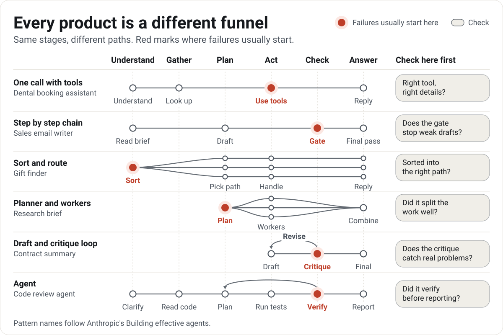

# How your AI works

Every AI product moves a request through a few stages before the customer sees a result. Which stages, and where things usually break, depends on how the product is built. In Set up, "How does your AI work?" offers eight patterns. The one you pick sets the starting stages of your funnel, and you can rename, reorder, or change them after.

The pattern names follow Anthropic's [Building effective agents](https://www.anthropic.com/engineering/building-effective-agents), which describes each one in depth. The stages and the advice on where failures start are pmstack's own, from reading traces of products built each way.

<picture>
  <source media="(prefers-color-scheme: dark)" srcset="../docs/assets/visuals/patterns-dark.svg">
  
</picture>

Every stage has a kind (understand, gather, plan, act, check, answer), so products built different ways line up on the same columns. Where failures usually start is where to read first, and where your first checks are most likely to pay off. Your own traces decide in the end: the funnel shows where your failures start.

pmstack guesses the pattern from your traces: many repeated tool calls suggest an agent, a hand-off or a step named like "route" suggests sort and route, two or more model steps suggest a chain, and any tool call or search suggests one call with tools.

## One model call

`single` · One prompt goes in and one reply comes out. No tools, no look-ups. Used for drafting, rewriting, or answering from what is already in the prompt.

| Stage | Kind | Steps it takes by default |
|---|---|---|
| Understand the request | understand | Set by the reviewer |
| Reply | answer | The final output |

**Where failures start:** understanding the request, since there is nothing else to go wrong before the reply. A reply that misreads the ask can still read well.

**Check first:** does the reply answer what was asked, using only facts from the prompt? Format rules for the channel (length, no formatting symbols in text messages) make good code checks.

## One call with tools

`augmented` · One model that can search, look things up, and call tools before it replies. Assistants that check a calendar, a database, or documents to answer. The Maple Dental booking assistant and the Larkspur Labs policy answer bot are built this way.

| Stage | Kind | Steps it takes by default |
|---|---|---|
| Understand the request | understand | Set by the reviewer |
| Look things up | gather | Searches (retrieval steps) |
| Use tools | act | Tool calls and their results |
| Reply | answer | The final output |

**Where failures start:** using tools: the wrong tool, the wrong details, or a skipped look-up. For answer bots that search documents, the look-up: the source the answer needed was never found.

**Check first:** right tool, right details? The [tool call checks](tool-call-evals.md) cover this with policy, relevance, and output grounding. For answer bots, mark the sources each answer needed and measure the look-up on its own (`/pmstack:evaluate-rag`).

## Step by step chain

`chain` · A fixed series of model calls, each working on the last one's output, often with a quality gate in between. Tasks that split cleanly into steps, such as research, then draft, then polish. The Tidewater Scheduling outreach email writer is built this way.

| Stage | Kind | Steps it takes by default |
|---|---|---|
| Understand the request | understand | Set by the reviewer |
| First draft | plan | Model steps |
| Quality gate | check | Guardrail steps |
| Final pass | answer | The final output |

**Where failures start:** the quality gate. A draft with an invented fact or the wrong tone should stop there, and when it doesn't, every later step polishes the mistake.

**Check first:** does the gate stop weak drafts? Compare what the gate passed with your notes on those traces.

## Sort and route

`routing` · A first step sorts the request, then sends it down the path built for that kind of request. Products that handle a few distinct kinds of requests, such as returns versus product questions. The Copper & Clay Kitchen gift finder is built this way.

| Stage | Kind | Steps it takes by default |
|---|---|---|
| Sort the request | understand | Set by the reviewer |
| Pick the right path | plan | Hand-off steps |
| Handle it | act | Tool calls, searches, and model steps |
| Reply | answer | The final output |

**Where failures start:** sorting. A request sorted into the wrong path gets a confident answer to a question nobody asked.

**Check first:** sorted into the right path? When traces record the path taken, compare it with the kind of request you saw while reviewing. A code check can test it, or an [intent map](tool-call-evals.md#intent-maps) when paths are tools.

## Split into parallel parts

`parallel` · Several model calls work at once on parts of the task, or on the same task for a vote, and the results are combined. Long inputs that split into sections, or decisions that gain from several independent opinions.

| Stage | Kind | Steps it takes by default |
|---|---|---|
| Split the work | plan | Set by the reviewer |
| Work in parallel | act | Model steps, tool calls, and their results |
| Safety screen | check | Guardrail steps |
| Combine results | answer | The final output |

**Where failures start:** combining. One part's result gets dropped, or two parts disagree and the combined answer picks one without saying so.

**Check first:** does the combined answer keep every part, and does it flag disagreements? A code check can count that each part shows up.

## Planner and workers

`orchestrator` · A planner decides what needs doing, hands pieces to workers, and combines what they send back. Open-ended tasks where the steps depend on the request, such as research briefs or changes across many files.

| Stage | Kind | Steps it takes by default |
|---|---|---|
| Plan the work | plan | Set by the reviewer |
| Hand out tasks | plan | Hand-off steps |
| Workers act | act | Model steps, tool calls, and searches |
| Combine results | answer | The final output |

**Where failures start:** the plan. A plan that splits the work badly (a piece missing, two workers doing the same thing) sets every worker up to fail.

**Check first:** did it split the work well? Read the plan against the request before you judge the workers' output.

## Draft and critique loop

`evaluator` · One call drafts, another critiques the draft against a clear bar, and the draft is revised until it passes. Work with a clear quality bar, such as summaries or translations that must keep every fact.

| Stage | Kind | Steps it takes by default |
|---|---|---|
| Draft | act | Model steps |
| Critique | check | Guardrail steps |
| Revise | act | Set by the reviewer |
| Final answer | answer | The final output |

**Where failures start:** the critique. A critique that misses a real problem, or flags a fine draft, sends the loop the wrong way.

**Check first:** does the critique catch real problems? Treat the critique step as a judge and compare its verdicts with your own labels.

## Agent

`agent` · The model picks its own steps, uses tools in a loop, and checks its progress until the task is done. Long tasks with steps nobody can list in advance, such as fixing code or working a support case. The pull request reviewer and the Northstar Internet support agent are built this way.

| Stage | Kind | Steps it takes by default |
|---|---|---|
| Clarify the task | understand | Set by the reviewer |
| Gather context | gather | Searches |
| Plan | plan | Set by the reviewer |
| Take actions | act | Tool calls and their results |
| Check results | check | Guardrail steps |
| Report back | answer | The final output |

**Where failures start:** checking results. An agent that reports success without verifying (the tests it never ran, the credit that is still pending) passes its mistake straight to the customer.

**Check first:** did it verify before reporting? Pair this with the [tool call checks](tool-call-evals.md): policy for what it may do, and output grounding for whether its report matches what its tools returned.

## Change the stages

The default stages are a starting point. Rename them in the customer's terms ("Check the calendar", not "Look things up"), add a stage your product has (the dental assistant adds "Hand off when needed"), and pick which tools belong to each. The [product setup guide](experience-config.md#stages) covers the rules.
