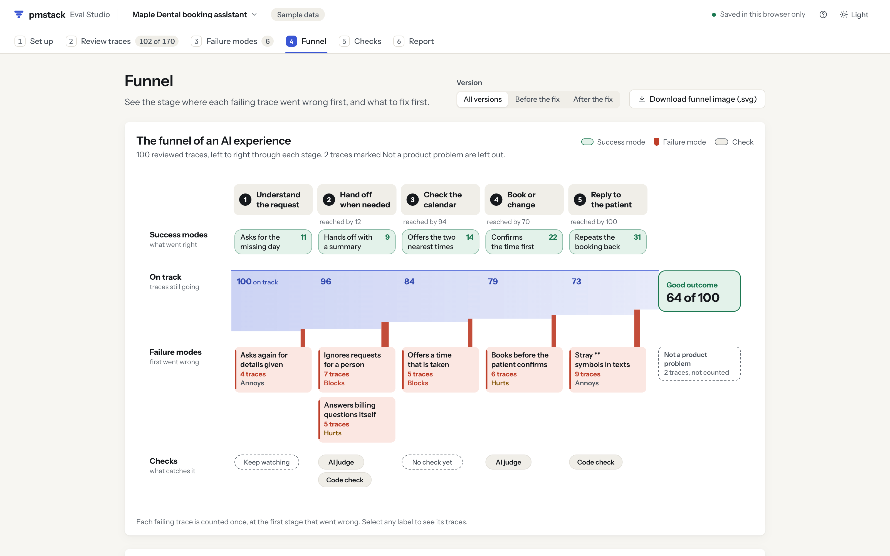

# The method, step by step

**Find how your AI product fails.**  
**Iterate. Raw pattern recognition meets Product Sense.**

Read real traces, name the failure modes, and turn the ones that matter into checks you can trust.

pmstack follows error discovery, the method Hamel Husain and Shreya Shankar teach. A trace is one full conversation or task, with every step the AI took and what the customer saw. You read traces before you pick anything to measure, because the failures that cost you customers are rarely the ones you would have guessed.

This guide walks through the six steps with the Maple Dental booking assistant, the sample that opens with 102 of its 170 traces already reviewed. [Open it in Eval Studio](https://ryanalberts.github.io/pmstack/studio/#/open/clinic-booking) and follow along.

<picture>
  <source media="(prefers-color-scheme: dark)" srcset="../docs/assets/visuals/loop-dark.svg">
  
</picture>

| Step | What you do | Where in Eval Studio |
|---|---|---|
| 1. Read traces | See each trace the way your customer saw it. | Review traces |
| 2. Write notes | Note the first thing that went wrong, in plain words. | Review traces |
| 3. Group into failure modes | Sort your notes into a short list of named problems, and name what went well as success modes. | Failure modes |
| 4. Count by stage | See where each failure mode starts and how often, then decide: fix it now, build a check, or keep watching. | Funnel |
| 5. Build checks | Turn each failure mode worth tracking into a code check or an AI judge. | Checks |
| 6. Test, then keep running | Make sure each check agrees with your labels, then run it on every change. | Checks, Report |

## Before you start

**Get real traces.** Export one row per conversation or task from your logging tool: the messages, the tool calls and results, and details such as the channel or the kind of customer. A spreadsheet export works. The [trace format guide](trace-format.md) lists every shape pmstack reads. With no traces yet, `/pmstack:synthetic-traces` in Claude Code writes realistic test requests, runs them through your product, and saves the results as traces.

**Pick one reviewer.** One person whose judgment sets the bar: usually the product manager, or the domain expert who knows what a good answer looks like (a dentist's front desk lead, a benefits specialist). A committee argues about every trace. One reviewer decides, and others can check the labels later.

**Set up the product.** In Set up, name the product, say who uses it (patient, employee, shopper), and describe what they are trying to do. pmstack guesses how your AI works, the stages, and the view from your traces. You can change every guess later; the [product setup guide](experience-config.md) covers the details.

**Plan the time.** Most people review 20 to 50 traces in about 30 minutes. Aim for 100 reviewed traces, or until new failure modes stop appearing.

## 1. Read traces

See each trace the way your customer saw it.

A text message reply that shows `**Parking:**` looks broken on a phone, and a transcript that reads fine in a log can sound rude on a call. So Eval Studio draws each trace in the form the customer saw: carrier-style bubbles for text messages (with formatting symbols shown as typed), a timed transcript for phone calls, an email client for emails, an answer with numbered sources for a policy bot.

Press H to show the steps behind the scenes: the system instructions, the tool calls, what each tool returned, the documents a search found. Read the customer's side first, then open the steps when you need to know what the AI saw.

Review traces hands you a set of 20 at a time, mixed across details like channel and conversation length, so you see a spread and not 20 look-alikes. When a set is done, pick 20 more. Other ways to pick: random, unusual ones (the longest and shortest), traces with a specific detail such as a thumbs-down, or traces where a judge disagrees with you.

## 2. Write notes

Note the first thing that went wrong, in plain words.

Write the note first, then pick a verdict: 1 for Good, 2 for Problem, 3 for Not sure yet. A good note:

- **Tells the customer's side.** What they asked, saw, or had to do.
- **Stops at the first thing that went wrong.** Later problems in the same trace usually follow from the first one.
- **Is specific.** A new teammate should be able to picture it.
- **Says what happened, not why.** Causes (the prompt, the model, the look-up) come after grouping.

Real notes from the dental sample:

| Weak note | Strong note from the sample |
|---|---|
| Didn't escalate. | Asked for the front desk, then asked them to call her. Bot said "Of course!" and went right back to Friday times. No transfer. |
| Hallucinated a slot. | Offered Sat 10am. Results said Sat was full, the 10am was Monday. Booking failed after he said yes. |
| Bad formatting. | Got "## Old Town" and dashes in a text. He only asked for an address. |

The weak notes can't be grouped or acted on, and one of them names a cause the reviewer can't see. The strong ones read like a patient's complaint, with the time, the words, and the result.

Good traces get an optional note too ("Two mornings, no wall of options, read it all back."). Those notes become success modes.

Pick where it first went wrong if you can: a stage chip, or hover a step in the trace and click "First thing that went wrong". Pick where the problem first shows, not why it happened. The [note rules for agents](../skills/pmstack-error-discovery/reviewing-traces.md) have more examples.

**AI help waits for you.** AI suggestions become available after you review 10 traces, and AI grouping after 30. Reading traces yourself first keeps your judgment in charge. After that, the AI help drawer gives you a prompt to paste into an AI assistant your company approves, or `/pmstack:error-discovery` in Claude Code watches your reviews and suggests likely failures on traces you haven't read. Suggestions show with a dashed purple border until you accept or dismiss them.

## 3. Group into failure modes

Sort your notes into a short list of named problems, and name what went well as success modes.

In Failure modes, select notes that describe the same problem and make a failure mode from them. Give it:

- **A name in the customer's terms.** "Ignores requests for a person", not "Escalation intent miss".
- **A definition anyone can test.** One sentence starting "Fails when": "Fails when the patient asks for a human (front desk, a person, call me) and the assistant keeps handling it instead of transferring."
- **A stage.** Where this kind of failure first shows.

Group by the fix each problem needs: merge notes that share a fix, and split look-alikes that need different fixes. One note can belong to more than one failure mode. Keep the list under 10, because more than that is hard to act on. Test sessions and traces you can't judge go in "Not a product problem", which the funnel leaves out.

<picture>
  <source media="(prefers-color-scheme: dark)" srcset="../docs/assets/visuals/notes-to-modes-dark.svg">
  
</picture>

Success modes work the same way, from the notes on Good traces: "Repeats the booking back" passes when the reply restates the day, time, and dentist. A success mode tells your engineers what to keep while they fix the rest.

**Re-check older traces.** When you create a failure mode after reviewing traces, the Good traces you read before it existed were never checked for it. Eval Studio counts them and shows a Re-check filter: for each one, answer "Shows this?" with Yes or No. The dental sample leaves 6 of these open for "Offers a time that is taken", so you can try it.

**Know when to stop.** The sparkline in Review traces shows new failure modes per 10 traces. In the dental sample, all six failure modes had appeared by trace 20, and the next 80 traces added none. That is the signal to move on to checks.

## 4. Count by stage

See where each failure mode starts and how often, then decide: fix it now, build a check, or keep watching.

The Funnel tab counts every failing trace once, at the first stage that went wrong. Traces set aside as not a product problem, and traces marked Not sure yet, stay out of the count.

<picture>
  <source media="(prefers-color-scheme: dark)" srcset="../docs/assets/screens/funnel-tab-dark.png">
  
</picture>

In the dental sample, 100 counted traces start on track. 4 drop at Understand the request, 12 at Hand off when needed, 5 at Check the calendar, 6 at Book or change, and 9 at Reply to the patient. 64 reach a good outcome. The drops show where to look: hand-offs lose more patients than any other stage.

**Rank by traces times severity.** Give each failure mode a severity: Blocks the customer (3), Hurts the customer or the business (2), or Annoys the customer (1). The "What to fix first" table multiplies it by the number of traces:

| Failure mode | Traces | Severity | Priority |
|---|---|---|---|
| Ignores requests for a person | 7 | Blocks | 21 |
| Offers a time that is taken | 5 | Blocks | 15 |
| Books before the patient confirms | 6 | Hurts | 12 |
| Answers billing questions itself | 5 | Hurts | 10 |
| Stray ** symbols in texts | 9 | Annoys | 9 |
| Asks again for details given | 4 | Annoys | 4 |

The most common failure mode is not always the one to fix first. Stray symbols show up most often, but a patient who can't reach a person gives up on the booking.

**Ask: did the AI's instructions ask for this?** If they didn't, fix the instructions first, and build a check only if it keeps failing after the fix or if it is critical. The dental assistant's instructions never said to write plain text in text messages, so "Stray ** symbols in texts" got one new line in the instructions. In the 20 traces from after the fix, the code check finds no symbols at all. If the instructions already asked for the behavior and the AI still slips, build a check.

Each failure mode gets a decision:

- **Fix it now.** A missing instruction or a clear bug. Add the instruction, then replay the regression set.
- **Build a check.** The instructions already ask for it and it still fails, or it is too costly to miss.
- **Keep watching.** Rare and mild. Look again after the next 100 traces.

## 5. Build checks

Turn each failure mode worth tracking into a code check or an AI judge.

Start with the question "Can a simple rule decide this?"

- **Code check** (a rule a computer can test). "No formatting symbols in text messages" is a pattern match on the AI's replies, limited to traces where the channel is sms. It is free, fast, and gives the same answer every time.
- **AI judge** (a prompt that asks a model to decide pass or fail for one failure mode). "Ignores requests for a person" needs judgment: the patient may ask for "someone at the office", "a human", or "call me", and the assistant may say it passed the request on without transferring. A judge reads the trace and answers Pass or Fail with a one-line critique.

One judge covers one failure mode, and it answers Pass or Fail, never a score from 1 to 5. Write a judge after you have at least 20 Problem and 20 Good labels for that failure mode; aim for about 50 of each. The [checks and AI judges guide](checks-and-judges.md) covers both kinds, and `/pmstack:write-judge` writes a judge with you.

Agents that call tools get three ready-made kinds of checks (policy, relevance, and output grounding). See [Tool call checks](tool-call-evals.md).

## 6. Test, then keep running

Make sure each check agrees with your labels, then run it on every change.

A check is only as good as its agreement with you. Eval Studio compares each check with your labels and shows two numbers:

- **Catches real failures.** Of the traces you marked as showing the problem, the share the check also caught.
- **Agrees on good traces.** Of the traces you marked Good, the share the check also marked Good.

You need both. A judge that always says Good agrees on every good trace and catches nothing. Aim for both above 90%, with 80% as the minimum.

<picture>
  <source media="(prefers-color-scheme: dark)" srcset="../docs/assets/visuals/judge-trust-dark.svg">
  
</picture>

In the dental sample, the stray symbols code check catches all 9 real failures and flags none of the 64 good traces. The billing words check catches only 3 of the 5 billing failures and flags 5 good traces: replies that remind the patient to bring an insurance card, or that correctly hand the patient to billing. A word list can't tell a billing answer from a billing hand-off, so this failure mode needs a judge. The person judge, measured on its tuning set, catches 8 of 9 failures and agrees on 33 of 35 good traces.

For AI judges, pmstack sets 40% of your labels aside as a final test. You improve the prompt on the tuning set, then look at the final test once. With the final test and the judge's results on traces you haven't labeled, pmstack gives the likely true failure rate: what the judge flagged, corrected for the mistakes it made on your labels, with a 95% range.

Then keep the checks running:

- **Run on every change.** Mark code checks "Run on every change" and hand them to your engineers with the regression set: the traces every future version must still handle. Your build replays them and runs `pmstack check`. See [running checks on every change](checks-and-judges.md#run-checks-on-every-change).
- **Watch production.** Run a validated judge on a random sample of new traces and track its likely true failure rate.
- **Read again after big changes.** New traces bring new failures. After a new model, a new tool, or a new kind of customer, add the new traces as a version and review about 100 of them.

## Share what you found

The Report tab turns all of this into one page: a summary sentence ("You reviewed 102 of 170 traces. 36 had a problem, and 2 were set aside as not a product problem."), the funnel, the failure modes with severity and decisions, the success modes, the checks with their agreement, a before and after table per version, and the next steps. Download it as Markdown, the funnel as an image, the regression set, and the checks your engineers run. The report quotes your traces, so read it before sharing outside your company.

## Where the method comes from

Error discovery comes from Hamel Husain and Shreya Shankar's teaching: their guides in Lenny's Newsletter, their course, and their evals FAQ. Links are in [Credits](credits.md). The two agreement numbers, the final test, and the corrected rate follow judgy, the open source library from their course.
