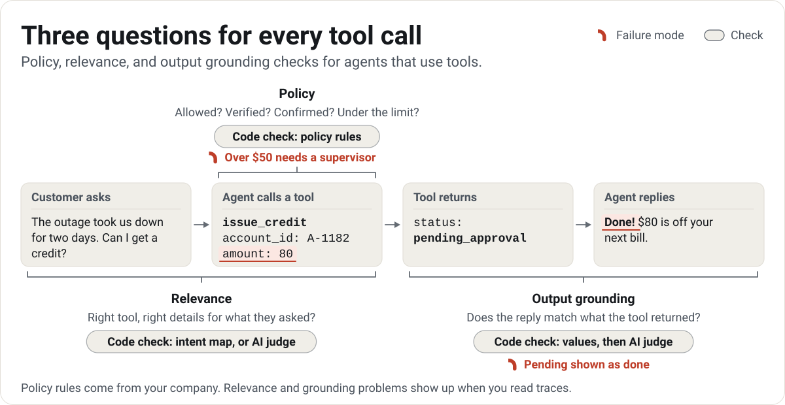

# Tool call checks

An agent that uses tools looks things up and changes things for your customer: it checks an account, issues a credit, books a visit. Each call can go wrong in its own way, and the reply can go wrong after it. Tool call checks ask three questions of every call.

<picture>
  <source media="(prefers-color-scheme: dark)" srcset="../docs/assets/visuals/tool-calls-dark.svg">
  
</picture>

1. **Policy: Is this call allowed?** Your company's rules for which tools the agent may use, when, and with what details.
2. **Relevance: Is it the right call for what the customer asked?** Right tool, right details, no calls the request didn't need, none it skipped.
3. **Output grounding: Does the reply match what the tool returned?** No contradicted values, no invented facts, no dropped qualifiers (pending shown as done), no success claimed after a failed call.

The examples in this guide come from the Northstar Internet support agent, a sample with 45 traces of an internet provider's agent that explains bills, gives credits, changes plans, and books technicians. [Open it in Eval Studio](https://ryanalberts.github.io/pmstack/studio/#/open/support-agent). Tool calls show inline by default there.

## How the three questions fit error discovery

Error discovery says: read traces first, then build checks for the failures you found. Policy is the one exception. Policy rules are requirements your company already knows (verify identity before touching an account, no credit over $50 without a supervisor), so you write them down up front. Then you read traces anyway, because traces show the rules nobody thought to write down.

Relevance and output grounding are the most common ways agents that use tools let customers down. Confirm them in your own traces with error discovery first, then use the checks and templates here as a head start instead of a blank page.

Each question has its own place in the funnel of an AI experience, which is where a failing trace is counted:

| Question | Where failures start | Check to start with |
|---|---|---|
| Policy | At the call itself (act) | Policy rules, a code check |
| Relevance | Where the agent chose the tool (plan, or act when there is no plan stage) | An intent map (a code check), or the relevance AI judge |
| Output grounding | At the reply (answer) | Two code checks, then the grounding AI judge |

In the Checks tab, a Tool call checks panel appears when your traces include tool calls. Each card creates a check tied to a failure mode: pick one you already have, or create one with the template's name ("Breaks a tool policy", "Wrong tool for the request", "Reply doesn't match the tool results"), definition, and stage.

## Policy

A policy is a file of rules in plain JSON (format `pmstack.policy/1`). It works in Eval Studio, on the command line, and in your own service before a call runs. [`templates/tool-calls/policy.json`](../templates/tool-calls/policy.json) is a complete worked example that uses every rule type, and [`policy-starter.json`](../templates/tool-calls/policy-starter.json) is a short one to start from.

```json
{
  "format": "pmstack.policy/1",
  "name": "Northstar support agent policy",
  "onlyListedTools": true,
  "confirmationPatterns": ["\\byes\\b", "\\bconfirm", "go ahead", "please do", "sounds good", "do it", "that works"],
  "tools": {
    "verify_identity": { "access": "read" },
    "issue_credit": { "access": "write", "confirm": true, "maxPerTrace": 1 }
  },
  "rules": [
    { "id": "credit-approval", "type": "approval-above", "tools": ["issue_credit"], "argPath": "amount", "max": 50,
      "approvalTool": "request_supervisor_approval", "why": "Credits over $50 need a supervisor." }
  ]
}
```

Every tool is `read` (it only looks something up) or `write` (it changes something). Every rule has a `why` in plain words, shown next to each violation, so write it for the person who reads the violation. Any rule can add `"when": { "path": "metadata.channel", "equals": "sms" }` to apply only to some traces, and `"tools": "*"` means every tool.

### Rule types

| Rule (as shown in Eval Studio) | Type | What it catches | Northstar example |
|---|---|---|---|
| Only listed tools | `onlyListedTools: true` | A call to any tool the policy doesn't list | A new or renamed tool the agent starts calling |
| Never use these tools | `deny-tools` | Calls to tools the agent may never use | `delete_account`, `run_sql` |
| No write actions | `deny-access` | Any write call, usually limited with `when` | No account changes over text message |
| Ask before acting | `confirm: true` on a tool | A write call without a yes from the customer. The agent must propose the action, and the customer's next message must match a confirmation pattern. | A credit applied before the customer agreed to it |
| At most N times per conversation | `maxPerTrace` on a tool | Too many calls to one tool (failed calls don't count, so a retry is fine) | One credit per conversation |
| Do this first | `requires-before` | A call made before a required earlier call that didn't fail. A call sent in the same batch doesn't count as earlier. | `get_bill` before `verify_identity` |
| Needs approval above a limit | `approval-above` | A value over the limit, or one that isn't a number, without an earlier successful approval call. A pending, denied, or unanswered approval doesn't count. | An $80 credit with no supervisor approval |
| Stay under a limit | `arg-max` | A value above a maximum, or one that isn't a number ("eight") | No credit over $200 |
| Stay above a limit | `arg-min` | A value below a minimum, or one that isn't a number | A credit of $0 |
| Only these values | `arg-in` | A value outside a list | A plan name other than basic, plus, or gig |
| Never include this pattern | `arg-not-match` | Text in any detail of a call that matches a pattern. With `"luhn": true`, a match counts only when its digits pass the check digit test every card number passes, so timestamps and order numbers are not flagged. | A full card number passed to a tool |
| Must include | `arg-required` | A call missing a detail | An account change with no `account_id` |
| Must match | `arg-equals` | A value that differs from an earlier tool result or a trace detail | `get_bill` on account A-1207 when the customer verified as A-1203 |

A violation reads as the fact, then the why: "issue_credit called with amount 80 without an earlier request_supervisor_approval. Credits over $50 need a supervisor." A card number in a violation is masked to its last four digits.

A limit rule reads only the detail at its `argPath`. A call that leaves that detail out, or sends it under another name, passes the limit, so pair each limit rule with a Must include rule on the same `argPath`. Use dots for nested values, like `change.percent` for a tool that takes `{"change": {"percent": 20}}`.

[`policy-requirements-checklist.md`](../templates/tool-calls/policy-requirements-checklist.md) turns company requirements into rules: the question to ask your policy owner for each requirement, and the rule type that encodes it. It covers tool allowlists, read and write access, confirmation, approvals and limits, identity checks, account scoping, sensitive data, channel and time limits, call limits, audit details, separation of duties, and irreversible actions.

### Try it on the sample

```sh
node bin/pmstack.mjs policy docs/studio/samples/support-agent.json --list-tools
node bin/pmstack.mjs policy docs/studio/samples/support-agent.json --policy templates/tool-calls/policy.json
```

`--list-tools` lists each tool with its call count and a first guess at read or write, taken from the name (names starting with get, list, search, lookup, find, read, or verify look like reads). Check each guess: it thinks `request_supervisor_approval` is a write. The second command prints each broken rule with its traces and steps, and ends with "Breaks the policy in 13 of 45 traces." It exits 1 when any call breaks the policy, so a build can stop on it.

### Stop a bad call before it runs

The policy check is plain JavaScript with no dependencies, so your service can run it before a tool call executes (a guardrail). Pass the conversation so far plus the call the agent wants to make:

```js
import { readFileSync } from 'node:fs';
import { evaluatePolicy } from './pmstack/docs/studio/lib/toolcalls.mjs';
import { normalizeTrace } from './pmstack/docs/studio/lib/traces.mjs';

const policy = JSON.parse(readFileSync('policy.json', 'utf8'));

// Call this before a tool call runs. `messages` is the conversation so far.
export function allowCall({ id, metadata, messages }, call) {
  const next = [...messages, { role: 'assistant', content: '', tool_calls: [call] }];
  const trace = normalizeTrace({ id, metadata, messages: next }, null);
  const callStep = `m${next.length - 1}.c0`; // judge only the new call; earlier calls already ran
  // userLabel is the word the reasons use for your users: replace 'customer' with your product's word.
  const reasons = evaluatePolicy(policy, trace, { userLabel: 'customer' }).violations
    .filter((v) => v.stepId === callStep)
    .map((v) => v.message);
  return { allowed: reasons.length === 0, reasons };
}
```

With the Northstar policy, an $80 credit after the customer's yes comes back `allowed: false` with "Credits over $50 need a supervisor." A $40 credit comes back allowed. When the agent sends several calls at once (a parallel batch), check each call on its own against the conversation before the batch. A guardrail that blocks good requests is a bug your customers feel, so run the policy on past traces first and use only rules that flag no good call.

## Relevance

Relevance asks whether each call serves what the customer asked. When your traces say what kind of request each one is (a router's label, a classifier, or your own review), an intent map checks it with no model at all.

### Intent maps

An intent map (format `pmstack.intents/1`) lists, for each kind of request, the tools it needs (`expect`), the tools it may also use (`allow`), and the tools it must never use (`never`). `intentFrom` names the detail that holds the kind of request.

```json
{
  "format": "pmstack.intents/1",
  "intentFrom": "metadata.intent",
  "intents": [
    { "id": "billing-question", "label": "Question about a bill", "expect": ["get_bill"],
      "allow": ["verify_identity", "lookup_account", "search_help_center"], "never": ["issue_credit", "cancel_service"] },
    { "id": "plan-change", "label": "Wants a different plan", "expect": ["change_plan"],
      "allow": ["verify_identity", "lookup_account", "get_bill", "search_help_center"], "never": ["cancel_service"] }
  ]
}
```

For each trace, the check reports:

- **Skipped a needed tool**: an `expect` tool that was never called.
- **Called a tool the request didn't need**: a call outside `expect` and `allow`.
- **Called a tool this request must never use**: a `never` tool that was called.

A trace with no intent passes with "No intent on this trace", and a trace whose intent the map doesn't list passes with a note saying so. On the Northstar sample the intent map flags 5 traces. Three answered a bill question without calling `get_bill`, and two called `cancel_service` when the customer wanted a cheaper plan. [`templates/tool-calls/intents.json`](../templates/tool-calls/intents.json) has all six Northstar intents. Build your own from real requests: group the requests you read into kinds, then list what each kind needs.

### The relevance judge

When traces don't carry an intent, or the right call takes judgment (the right tool with the wrong date is still wrong), use the AI judge template. In the Checks tab, choose Relevance, then "Use the AI judge template". The judge checks that the agent:

- picks the tool that serves what the customer asked;
- passes details that match what the customer said (dates, amounts, ids, names);
- makes no calls the request didn't need, and skips none it did;
- asks a question instead of guessing when a required detail is missing.

It sees what the customer said and the tool calls. [`relevance-judge.md`](../templates/tool-calls/relevance-judge.md) is the same prompt as a file for your own tools. Validate it against your labels like any judge ([Checks and AI judges](checks-and-judges.md#agreement-two-numbers)).

## Output grounding

Output grounding asks whether the reply matches what the tools returned. Start with two free code checks, then add a judge for what exact matching misses.

| Check | Fails when | Northstar example |
|---|---|---|
| Every number in the reply comes from a tool | The reply states money, a percentage, a time, a date, a number with a unit, or an id or confirmation number that no tool result, tool call, retrieved document, or customer message contains | "Not found in tool results: 8:00 AM" (the booking returned a 12:00 to 16:00 arrival window) |
| Claims success after a failed or pending call | The reply uses a success word (done, booked, confirmed, applied, refunded, cancelled, scheduled, updated, all set, taken care of) after the last write call returned an error, or a result saying failed, denied, or pending | "The reply says "Done", but issue_credit returned status "pending_approval"" |

Values are compared after light cleanup: `$1,234.50` equals `1234.5`, `9:30 AM` equals `09:30`, and `Sept 25` equals `2026-09-25`. On the Northstar sample, the value check flags 2 traces and the failed-call check flags 5.

The grounding judge covers the rest. It checks that every fact in the reply is backed by a tool result, that no value differs from one, that qualifiers such as pending, estimated, partial, or "until a date" stay in, that nothing is described as done unless a tool result shows it done, and that the reply leaves out no tool result that changes what the customer should do next. Give it the tool results and the reply, not the whole trace when traces are long. [`grounding-judge.md`](../templates/tool-calls/grounding-judge.md) has the prompt as a file.

## How to read the results

The policy rules and the two grounding code checks are fast first-pass filters. Read what they flag before you trust the counts, and tune them where your traces need it:

- **"Ask before acting" matches words, not meaning.** A confirmation pattern counts as a yes unless a refusal comes right before it or "not" right after it, so "No, don't do it" and "Please do not" are not a yes. A question that contains a pattern ("Before you do it, can you confirm my balance?") still reads as a yes. When your customers answer that way, tighten the patterns (`"^\\s*yes\\b"`) or move the check to a judge.
- **"Every number in the reply comes from a tool" needs exact values.** A reply that adds two tool results ("your bill is $110" from $80 plus $30) is flagged, because no tool returned 110. A flag on a correct sum is a false alarm to note, and a reason to keep the judge for arithmetic.
- **"Claims success after a failed or pending call" looks for success words.** "A technician will see you Friday" after a failed booking uses none of them, so it passes. The grounding judge catches the paraphrase.

Each flag links to its trace and step. Mark real problems with the failure mode, so your labels, not the check, set the count. Agreement with your labels then tells you how far to trust each check, the same as any code check.

## From the command line

```sh
# List the tools in your traces, with a guess at read or write
node bin/pmstack.mjs policy traces.jsonl --list-tools

# Check every trace against a policy; --json prints results for scripts
node bin/pmstack.mjs policy traces.jsonl --policy pmstack/policy.json

# Run every check in a project, including policy, intent map, and grounding checks
node bin/pmstack.mjs check pmstack/project.json
```

`policy` and `check` exit 1 when anything fails and 2 when a file can't be read. `pmstack check` runs policy and intent map checks like any other code check, including with `--expect` in your build. See the [command line guide](cli.md#policy).

## In Claude Code

- `/pmstack:tool-policy` gathers your company's requirements with the checklist, lists your tools, writes the policy, reviews every violation with you, adds the check to your project, and shows the guardrail.
- `/pmstack:tool-relevance` confirms relevance failures in your notes, builds an intent map from real requests or sets up the relevance judge, and validates it.
- `/pmstack:tool-grounding` confirms grounding failures, adds the two code checks, tunes them on what they flag, then sets up the grounding judge.
